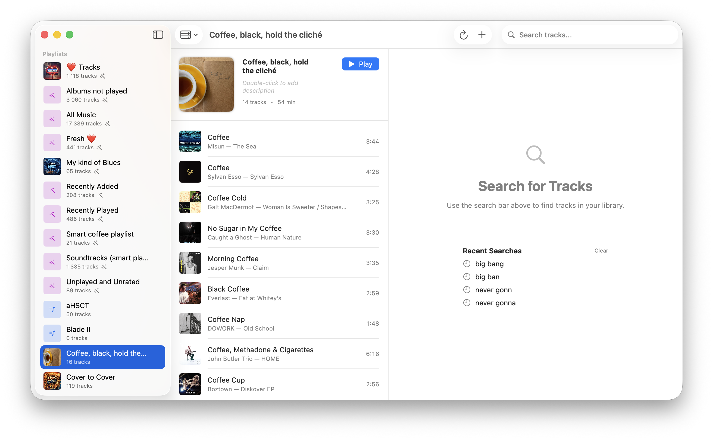

# Playlister

A native macOS app for managing Plex music playlists.


## Features

- **Three-Column Layout**: Browse playlists, view tracks, and search your library
- **Smart Playlists**: Create dynamic playlists with custom rules and filters
- **Import Playlists**: Import from text files or paste track lists (Artist - Title format)
- **Audio Preview**: Listen to tracks before adding them to playlists
- **Drag & Drop**: Easily reorder tracks within playlists
- **Multi-Select Reordering**: Select multiple tracks (⌘+Click) and drag them to reorder as a group
- **Plex OAuth**: Secure authentication with your Plex account
- **Self-Signed SSL Support**: Works with home servers using self-signed certificates

## Screenshots



## Requirements

- macOS 26.0 (Tahoe) or later
- Plex Media Server with a music library
- Plex account

## Installation

### From Source

1. Clone the repository:
   ```bash
   git clone https://github.com/brunoamaral/playlister.git
   cd playlister
   ```

2. Open in Xcode:
   ```bash
   open Playlister.xcodeproj
   ```

3. Build and run (⌘R) or archive for distribution (⌘⇧R)

### Build from Command Line

```bash
xcodebuild -scheme Playlister -configuration Release build SYMROOT="$PWD/build"
cp -R build/Release/Playlister.app /Applications/
```

## Usage

1. **Login**: Click "Sign in with Plex" to authenticate
2. **Select Server**: Choose your Plex server and music library
3. **Browse Playlists**: View and manage your playlists in the left column
4. **Search Tracks**: Use the search bar to find tracks in your library
5. **Add Tracks**: Click the + button or drag tracks to add them to playlists

### Reordering Tracks

- **Single Track**: Drag any track to reorder it within the playlist
- **Multiple Tracks**: 
  - Use ⌘+Click to select multiple tracks, or click "Select" in the playlist header
  - Once tracks are selected, drag any selected track to move them all together
  - Click "Done" or press Escape to exit selection mode

### Smart Playlists

Create dynamic playlists that automatically update based on filter rules:

**Available Filters:**
- **Text fields** (Artist, Album, Title, Genre): contains, does not contain, is exactly, begins with, ends with
- **Numeric fields** (Year, Rating, Play Count): equals, not equals, greater than, less than
- **Date fields** (Date Added, Last Played): in the last X days, not in the last X days

**Options:**
- Match **all** rules (AND) or **any** rule (OR)
- Limit results by track count
- Sort by: random, most played, least played, recently added, highest rated

### Settings

- **Allow Insecure Connections**: Enable for servers with self-signed SSL certificates

## Architecture

The app follows the MVVM (Model-View-ViewModel) pattern:

```
Playlister/
├── Models/          # Data models (Track, Playlist, etc.)
├── Views/           # SwiftUI views
├── ViewModels/      # View models for business logic
├── Services/        # API and audio services
└── Utilities/       # Helper classes and extensions
```

## Contributing

Contributions are welcome! Please feel free to submit a Pull Request.

1. Fork the repository
2. Create your feature branch (`git checkout -b feature/amazing-feature`)
3. Commit your changes (`git commit -m 'Add some amazing feature'`)
4. Push to the branch (`git push origin feature/amazing-feature`)
5. Open a Pull Request

## License

This project is licensed under the MIT License - see the [LICENSE](LICENSE) file for details.

## Acknowledgments

- [Plex](https://plex.tv) for the amazing media server
- Built with SwiftUI and AVFoundation

## Disclaimer

This project is not affiliated with or endorsed by Plex, Inc.
